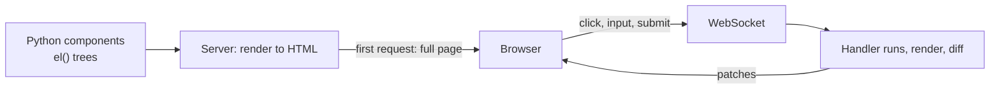

<div align="center">

# Nexoria

**Write the whole web page in Python.** Server-rendered HTML, live DOM patches over a WebSocket, a batteries-included component library, and optional native acceleration — with nothing to learn but Python.

`v0.1.0` · MIT · Python ≥ 3.9 · by Divyanshu Sinha · part of the Pythonaibrain ecosystem

[Documentation](docs/README.md) · [Architecture](docs/ARCHITECTURE.md) · [Flowcharts](docs/FLOWCHART.md) · [API reference](docs/TOP-LEVEL-API-REFRANCE.md) · [Q&A](docs/Q-A.md)

</div>

---

## Why Nexoria

- **One language.** UI is a tree of Python objects (`el("div", …)`). No JSX, no template language, no separate frontend project.
- **Server-rendered first.** The first response is real, complete HTML — instant, indexable, works before JavaScript loads.
- **Live by default.** Event handlers are Python functions. The server re-renders, diffs, and sends the browser the smallest set of patches.
- **Tiny client.** One hand-written runtime (≈6.5 KB unminified) hydrates the page and applies patches. No build step needed.
- **Batteries included.** 13 families of ready-made components — three design systems, 2,078 offline icons, animation, SVG charts, typography, web tools — plus adapters for 16 popular JavaScript libraries.
- **Native when you want it, Python when you don't.** Optional Rust, C++, Go and CUDA tiers speed things up or harden production; every one falls back to pure Python.

## Install

```bash
pip install nexoria          # or, from a checkout: pip install -e .
```

Runtime dependencies: `starlette`, `uvicorn[standard]`, `jinja2`, `watchfiles`, `rich`. Nothing else is required to run an app.

## Hello, live counter

```python
# app.py
from nexoria import App, Component, Router, State, el

class Counter(Component):
    def setup(self):
        self.state = State({"count": 0})

    def render(self):
        return el("div",
            el("h1", f"Count: {self.state['count']}"),
            el("button", "Increment", class_="nx-btn",
               on_click=lambda e: self.state.update(count=self.state["count"] + 1)),
            class_="nx-card nx-container",
        )

app = App(name="Counter", router=Router().add("/", Counter))

if __name__ == "__main__":
    app.run(reload=True)     # http://127.0.0.1:8000
```

Click the button and the browser receives exactly this:

```json
{"type": "patch", "patches": [
  {"op": "text", "path": [0, 0], "payload": "Count: 1"},
  {"op": "update_props", "path": [1], "payload": {"events": {"click": "h2"}, "props": {}}}
]}
```

## How it works



1. `GET /` → your component renders → complete HTML plus a small hydration payload.
2. `runtime.js` opens `/_nexoria/live` and delegates events.
3. An event runs your Python handler; the server re-renders and diffs; the browser applies the patches.

More in [ARCHITECTURE.md](docs/ARCHITECTURE.md) and [FLOWCHART.md](docs/FLOWCHART.md).

## Feature tour

### Core

| | |
|---|---|
| `App`, `Component`, `el()` | ASGI app, page/widget classes, element builder — [core](docs/core.md) |
| `State` | Reactive dict — [state](docs/state.md) |
| `Router` | `/static`, `/:param`, `/*`, guards, not-found — [router](docs/router.md) |
| `Theme`, `Stylesheet` | Design tokens, scoped CSS, persisted dark/light toggle — [style](docs/style.md) |
| Middleware | Pre-routing hooks — [middleware](docs/middleware.md) |
| `js`, `Script`, `JSFunction` | Safe client-side JavaScript from Python — [js](docs/js.md) |
| CLI | `new`, `dev`, `build`, `doctor`, `native …` — [cli](docs/cli.md) |

### Standard library — `nexoria.std` ([overview](docs/std.md))

| Family | What you get |
|---|---|
| [premium](docs/std/premium.md) · [cartoon](docs/std/cartoon.md) · [lib](docs/std/lib.md) | Three complete visual design systems (SaaS, comic, dev-tool) |
| [icons](docs/std/icons.md) | 2,078 Bootstrap Icons as inline SVG, fully offline |
| [animation](docs/std/animation.md) | Scroll reveals, counters, typewriter, scramble, split text, SVG draw/morph, 21 keyframe presets |
| [charts](docs/std/charts.md) · [svg](docs/std/svg.md) | Animated SVG line/area/bar/pie/donut/sparkline/gauge, and a fluent path builder |
| [typography](docs/std/typography.md) | `@font-face` registry and fluid `clamp()` type scale |
| [alert](docs/std/alert.md) · [webtools](docs/std/webtools.md) · [scroll](docs/std/scroll.md) | Toasts, modals, tabs, accordion, tooltips, copy button, scroll tools |
| [observer](docs/std/observer.md) · [physics2d](docs/std/physics2d.md) | Gesture callbacks and projectile/confetti motion |

### Integrations — turn on with one flag

| Flag | Library | Flag | Library |
|---|---|---|---|
| `threejs=True` | [Three.js](docs/threejs.md) | `bootstrap=True` | [Bootstrap 5](docs/bootstrap.md) |
| `babylonjs=True` | [Babylon.js](docs/babylonjs.md) | `tailwind=True` | [Tailwind CSS](docs/tailwind.md) |
| `vroid=True` | [VRM avatars](docs/vroid.md) | `iconify=True` | [Iconify](docs/iconify.md) |
| `spline=True` | [Spline](docs/spline.md) | `shiki=True` | [Shiki](docs/shiki.md) |
| `gsap=True` | [GSAP + plugins](docs/gsap.md) | `qrcode=True` | [QR codes](docs/qrcode.md) |
| `chartjs=True` | [Chart.js](docs/chartjs.md) | `barcode=True` | [Barcodes](docs/barcode.md) |
| `videojs=True` | [video.js](docs/videojs.md) | `openlayers=True` | [OpenLayers](docs/openlayers.md) |
| `aggrid=True` | [AG Grid](docs/aggrid.md) | `webcam=True` | [Webcam](docs/webcam.md) |

Plus [`nexoria.translate`](docs/translate.md) (server-side Google Translate).

### Native tiers — all optional ([native](docs/native.md))

| Tier | Purpose | Fallback |
|---|---|---|
| PyO3 Rust ([rust_ext](docs/rust_ext.md)) | Fast differ, hashing | Python |
| Rust safety core + C++ VDOM | Fastest differ with memory-safe key interning | Rust → Python |
| QuickJS-ng + npm client | Run pure-JS npm packages from Python | feature unavailable |
| Go edge server | Static cache, gzip, request firewall, reverse proxy | plain uvicorn |
| CUDA | Batch hashing / row diff | Python |

```bash
nexoria doctor                          # what's active, what's missing
nexoria native build --with-go-server   # build optional tiers
```

### Ship anywhere

- **Web:** `python app.py`, `uvicorn app:app`, or behind the Go edge server.
- **Desktop:** `nexoria build-desktop` → Electron shell ([desktop](docs/desktop.md)).
- **Mobile:** `nexoria build-mobile` → Capacitor shell around your deployed server ([mobile](docs/mobile.md)).
- **Assets:** `nexoria build` → hashed runtime, bundled JS, optional Tailwind ([tools](docs/tools.md)).

## Repository layout

```
nexoria/
├── docs/            documentation (start at docs/README.md)
├── examples/        13 runnable demo apps
├── tests/           pytest suite
├── tools/node-build Node production build tool
└── nexoria/         the package: core, state, router, render, style, middleware, cache, cli,
                     runtime, std, 16 integrations, translate, js, native, rust_ext, desktop, mobile
```

## Examples

```bash
cd examples/counter_app && python app.py
```

`counter_app`, `blog_demo`, `ecommerce_demo`, `threejs_demo`, `gsap_demo`, `dashboard_demo`, `bootstrap_demo`, `aggrid_tailwind_demo`, `premium_cartoon_landing_demo`, and four `std_*` demos — see [examples](docs/examples.md).

## Testing

```bash
pip install -e .[dev] httpx
pytest -q
```

## Status and honest limitations

Nexoria is **beta (0.1.0)**. Things to know before you build on it (each is explained, with workarounds, in the docs):

- On the plain-uvicorn path, `/static/*` is shadowed by the catch-all page route; the Go edge server serves it correctly. → [core](docs/core.md#known-issues)
- Live updates are driven by handled events; background state changes are not pushed. → [core](docs/core.md#known-issues)
- Keyed-list reorders and multi-item removals in a single update are not patched correctly. → [render](docs/render.md#known-limitations-of-keyed-lists)
- Sessions are held in process memory: use one worker (or sticky routing) per address. → [Q&A](docs/Q-A.md#f-deployment-and-scaling)
- The `premium`/`cartoon`/`lib` families need their theme applied for accent colours. → [std](docs/std.md#apply-the-family-theme-important)

The full list is in [ARCHITECTURE §15](docs/ARCHITECTURE.md#15-known-limitations-summary).

## License

MIT © 2026 Divyanshu Sinha.
