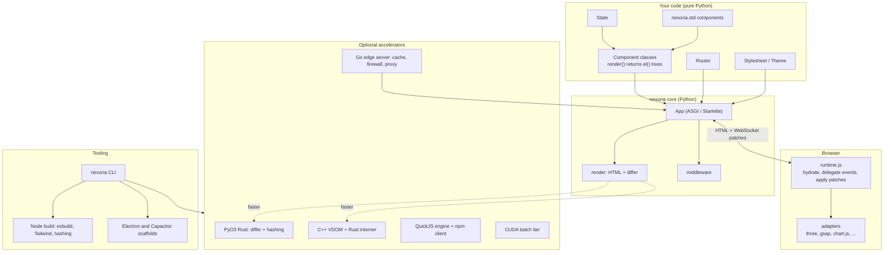
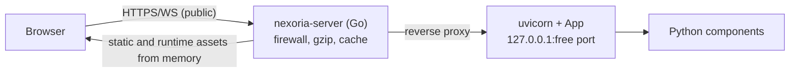

# Nexoria Architecture

This document explains **how Nexoria is put together and why**. For symbol-level detail see [TOP-LEVEL-API-REFRANCE.md](TOP-LEVEL-API-REFRANCE.md); for step-by-step sequences see [FLOWCHART.md](FLOWCHART.md); for design rationale in question form see [Q-A.md](Q-A.md).

---

## 1. Design principles

1. **One language for the whole page.** UI is a tree of Python objects (`el("div", …)`), routes are Python classes, styling is Python dicts. There is no template language and no JSX.
2. **The server is authoritative.** State lives in Python; the browser is a thin renderer. Event handlers execute on the server and the browser receives the smallest set of DOM patches that reflect the change.
3. **Server-rendered first.** The first response is complete, real HTML — indexable and usable before any JavaScript runs. Hydration is layered on top.
4. **Small runtime, no build step required.** The client is one hand-written file (`runtime.js`, ≈6.5 KB unminified). Node is only needed for the optional production build.
5. **Everything heavy is optional and falls back.** Rust, C++, Go and CUDA tiers accelerate or harden things but are never required; every one degrades to plain Python.
6. **Adapters, not dependencies.** Third-party JS (Three.js, GSAP, Chart.js, …) is described from Python and loaded from a CDN only when you switch it on. Nothing is added to Python's dependency list.

---

## 2. System overview



---

## 3. Repository layout

```
nexoria/                     repository root
├── README.md                project overview
├── docs/                    this documentation
├── examples/                13 runnable demo apps
├── tests/                   pytest suite (18 files)
├── tools/node-build/        Node production build tool
├── pyproject.toml           maturin build config, deps, CLI entry point
└── nexoria/                 the Python package
    ├── core/                App, Component, Element / el()
    ├── state/               State, use_state
    ├── router/              Router, Route
    ├── render/              HTML serialiser, differ
    ├── style/               Theme, Stylesheet, theme toggle
    ├── middleware/          Middleware protocol + built-ins
    ├── cache/               content fingerprinting
    ├── cli/                 the `nexoria` command
    ├── runtime/             runtime.js, base.css, adapters, favicon
    ├── std/                 13 component families (+ 2,078 icons)
    ├── threejs/ gsap/ chartjs/ videojs/ aggrid/ spline/ vroid/ babylonjs/
    │   bootstrap/ tailwind/ iconify/ shiki/ qrcode/ barcode/ openlayers/ webcam/
    │                        third-party integration wrappers
    ├── translate/           server-side Google Translate client
    ├── js/                  client-side JS helpers (js, Script, JSFunction)
    ├── native/              Rust safety core, C++ VDOM, JS engine, Go server, CUDA
    ├── rust_ext/            PyO3 extension (differ, hashing)
    ├── desktop/ mobile/     Electron / Capacitor scaffolding
    └── ssr/                 (empty, reserved)
```

Every folder has a page in this documentation: see the [index](README.md#documentation-map).

---

## 4. The core model

### 4.1 `Element` — the virtual DOM node

`el(tag, *children, **props)` builds an immutable-in-practice tree of `Element`s. Each node holds `tag`, `props`, `children`, an optional `key`, and a registry of **event handlers**. A handler is a Python callable stored on the element and identified by a process-wide counter id (`h1`, `h2`, …). `to_dict()` serialises a node to the wire format shared by the differ, the hydration payload and the Rust/C++ backends.

### 4.2 `Component`

A class with `setup()` (once) and `render()` (every render) that returns an `Element`. It owns a `State`, receives route parameters as `props`, and may declare a scoped `Stylesheet`.

### 4.3 `State`

A dict-like store whose writes notify subscribers. It is per component **instance**, and an instance is created per **page load**, so state is per browser tab and lives in server memory.

### 4.4 `Router`

An ordered list of `Route`s (`/static`, `/:param`, `/*`), guards and an optional not-found component. First match wins.

### 4.5 `App`

An ASGI application (a thin wrapper over Starlette). It owns the router, middleware list, themes, stylesheets, the integration flags, and the in-memory **session table** `{session_id → {component, tree, handlers}}`.

---

## 5. Server-side rendering and hydration

1. A `GET` arrives at the catch-all route; middleware may short-circuit.
2. `Router.resolve` instantiates the matching component (path params + query params as props).
3. `component.render()` → `Element` tree.
4. `render_to_html` serialises it; event handlers become `data-nx-on-<event>="<id>"` attributes, never inline JS.
5. The `App` records a **session**: the component, the tree and the `id → callable` map.
6. `_build_head` assembles theme variables, base CSS, merged stylesheets, SEO tags, one merged import map and each enabled integration's tags.
7. `render_document` returns the page. Its tail carries `runtime.js` and a JSON **hydration payload** (`route`, `tree`, `component`, `session`).

The browser can already show the whole page. `runtime.js` then opens a WebSocket and starts delegating events.

---

## 6. The live update protocol

**Client → server** (one JSON message per user event):

```json
{"event": "click", "handler_id": "h3", "session": "<hex>", "payload": {"value": null, "key": null}}
```

**Server → client** (only one message type exists, `patch`):

```json
{"type": "patch", "patches": [{"op": "text", "path": [0, 0], "payload": "Clicked 1 times"},
                              {"op": "update_props", "path": [1], "payload": {"events": {"click": "h2"}, "props": {}}}]}
```

Server-side, on each event: look up the session → run the handler (awaited if async) → call `render()` again → `diff(old_tree, new_tree)` → replace the stored tree and **regenerate the handler map** → send the patches. The client applies them sequentially to the DOM.

Consequences of this design:

- **No client state to keep in sync.** The DOM is a projection of the last tree the server rendered.
- **Every interactive element is re-labelled each render** (fresh handler ids), so a re-render always includes an `update_props` patch for elements that have handlers.
- **Latency is a round trip** for anything that goes through `on_*`. Interactions that must be instant use literal `onclick="…"` strings and never touch the server; the standard library uses this for tooltips, modals, tabs, toasts and more.

The full sequence is diagrammed in [FLOWCHART.md](FLOWCHART.md#3-event--patch-cycle).

---

## 7. The differ and its three backends

`nexoria.render.diff.diff(old, new)` produces `text | replace | insert | remove | update_props` patches addressed by child-index path. Three interchangeable implementations exist:

| Backend | Where | Selected when |
|---|---|---|
| Native C++ + Rust interner | `nexoria/native/cpp/vdom` | `_nexoria_vdom_cpp` imports |
| PyO3 Rust | `nexoria/rust_ext` | `_nexoria_rs` imports |
| Pure Python | `nexoria/render/diff.py` | always available |

They implement the same algorithm and are validated with the same vectors. Precedence is C++ > Rust > Python. The keyed-children path has [documented limitations](render.md#known-limitations-of-keyed-lists) that are shared by all three.

---

## 8. Styling architecture

- **Tokens.** A `Theme` dataclass renders as `--nx-*` CSS variables on `:root`; `LIGHT_THEME` overrides them under `[data-nx-theme="light"]`.
- **No flash of the wrong theme.** A blocking inline script sets `data-nx-theme` before CSS is parsed; `runtime.js` exposes `toggleTheme()`.
- **Base classes.** `nx-*` classes in `base.css` consume the tokens.
- **Scoped CSS.** `Stylesheet.scoped_class()` creates content-hashed class names.
- **Design systems.** `std.premium/cartoon/lib` each extend `Theme` with their own tokens.

---

## 9. Integration (adapter) architecture

Every third-party integration follows one shape:

```
Python dataclass ──to_element()──► <div class="nx-<lib>-…" data-nx-<lib>='{json spec}'>
                                          │
App(<lib>=True) ─► head: import-map entry / CDN tag + adapter script
                                          │
runtime/<lib>-adapter.js ─ scans for the class on load ─► builds the real library object
                          └► window.__nexoria__.<lib>  (+ nexoria:<lib>:ready events)
```

- The **spec is JSON**, so it survives SSR, the hydration payload and patches unchanged.
- ES-module libraries share **one merged import map** (browsers honour only one per document). Libraries whose ESM builds have deep dependency chains (video.js, OpenLayers, Bootstrap, iconify-icon, Tailwind) load as classic scripts instead.
- Adapters mount **once at load**. Elements added later by a patch need an explicit `mountNew()` (see [runtime](runtime.md)).

Available adapters: [three.js](threejs.md), [GSAP](gsap.md), [Chart.js](chartjs.md), [video.js](videojs.md), [AG Grid](aggrid.md), [Spline](spline.md), [VRoid/VRM](vroid.md), [Babylon.js](babylonjs.md), [Bootstrap](bootstrap.md), [Tailwind](tailwind.md), [Iconify](iconify.md), [Shiki](shiki.md), [QR](qrcode.md), [barcodes](barcode.md), [OpenLayers](openlayers.md), [webcam](webcam.md).

---

## 10. The standard library (`nexoria.std`)

Pure-Python component functions that return `Element`s: three design systems, icons, alerts, animation, observer, physics, scroll tools, an SVG path builder, SVG charts, a typography engine and web tools. Interactivity is delivered as literal HTML attributes or one idempotent inline runtime per family — no CDN, no `App` flag. See [std](std.md).

---

## 11. Native tiers

| Tier | Role | Fallback |
|---|---|---|
| PyO3 Rust | differ, fingerprints | Python |
| Rust safety core + C++ VDOM | fastest differ, key interning with memory-safe ownership | Rust → Python |
| QuickJS-ng engine + npm client | run pure-JS npm packages from Python | none (feature unavailable) |
| Go edge server | static cache, gzip, firewall, reverse proxy, real timeouts | plain uvicorn |
| CUDA | batch hashing/row-diff | pure Python |

The rule for the whole stack: **Python is the source of truth; native code only makes the same thing faster or safer.** Details: [native](native.md), [rust_ext](rust_ext.md).

### Production topology (with the Go edge)



The Python backend is bound to loopback; only the Go process should be exposed.

---

## 12. Tooling

- **CLI** (`nexoria`): scaffold, dev, build, doctor, native build/clean/status, desktop/mobile scaffolds. → [cli](cli.md)
- **Node build tool**: hashed runtime, esbuild bundling of `static/*.js`, optional Tailwind compile, `dist/manifest.json`. → [tools](tools.md)
- **Packaging**: `maturin` builds the wheel with the Rust extension; `MANIFEST.in`/`[tool.maturin]` control what ships.

---

## 13. Concurrency and scaling model

- One `App` per process; sessions in a process-local dict.
- Handlers may be `async`; sync handlers block the event loop for their duration.
- With multiple worker processes a WebSocket may land on a worker that does not hold the session; events are then ignored. Use a single worker per public address, or sticky routing, until sessions are externalised.
- Memory grows with **open pages** (one component instance, one tree and one handler map each), released when the socket closes.

## 14. Security notes

- Attribute values and text are HTML-escaped; `<script>`/`<style>` contents are emitted raw with only `</` neutralised. Use `nexoria.js.js()` to embed values in JavaScript safely.
- `on_*` handlers are addressed by opaque session-scoped ids; the client cannot invoke arbitrary Python.
- The Python-only path has no request firewall, no CORS handling and no rate limiting; the Go edge server adds a firewall (allow/deny lists, per-IP rate limiting, body caps, request sanity checks). Put a real reverse proxy or the Go tier in front for public deployments.
- CDN-loaded libraries execute in your origin; pin, self-host, or add integrity controls as your policy requires. Shiki loads through a bundling CDN (esm.sh).

## 15. Known limitations (summary)

Collected from the per-package pages so you can see them in one place:

| Area | Limitation | Detail |
|---|---|---|
| `/static` | Shadowed by the catch-all route on the plain-uvicorn path | [core](core.md#known-issues) |
| Not-found | Custom not-found component returns HTTP 200 | [core](core.md#known-issues) |
| Handlers | An exception in a handler ends the live channel silently | [core](core.md#known-issues) |
| Reactivity | State changes outside a handler are not pushed | [core](core.md#known-issues) |
| Lifecycle | `on_mount` / `on_unmount` are never invoked | [core](core.md#2-component) |
| Diff | Keyed reorders / multi-remove misapply | [render](render.md#known-limitations-of-keyed-lists) |
| CSS | Scoped classes created after first render lack CSS | [style](style.md#things-to-know) |
| std themes | Family tokens undefined unless the family theme is applied | [std](std.md#apply-the-family-theme-important) |
| CORS | `CORSMiddleware` is a placeholder | [middleware](middleware.md) |
| Build | `dist/` and its manifest are not auto-served | [tools](tools.md) |
| AG Grid | Only the Quartz theme CSS is auto-linked | [aggrid](aggrid.md) |
