# Nexoria Flowcharts

Diagrams are [Mermaid](https://mermaid.js.org) and render natively on GitHub and in most Markdown viewers. Companion documents: [ARCHITECTURE.md](ARCHITECTURE.md), [TOP-LEVEL-API-REFRANCE.md](TOP-LEVEL-API-REFRANCE.md).

**Contents:** 1. [Page request (SSR)](#1-page-request-ssr) · 2. [Hydration](#2-hydration) · 3. [Event → patch cycle](#3-event--patch-cycle) · 4. [Differ](#4-the-differ) · 5. [Router matching](#5-router-matching) · 6. [`App.run()` mode selection](#6-apprun-mode-selection) · 7. [Go edge request path](#7-go-edge-request-path) · 8. [`<head>` assembly](#8-head-assembly) · 9. [Integration lifecycle](#9-integration-lifecycle) · 10. [Native tier selection](#10-native-tier-selection) · 11. [`nexoria build`](#11-nexoria-build) · 12. [`nexoria native build`](#12-nexoria-native-build) · 13. [Theme toggle](#13-theme-toggle)

---

## 1. Page request (SSR)

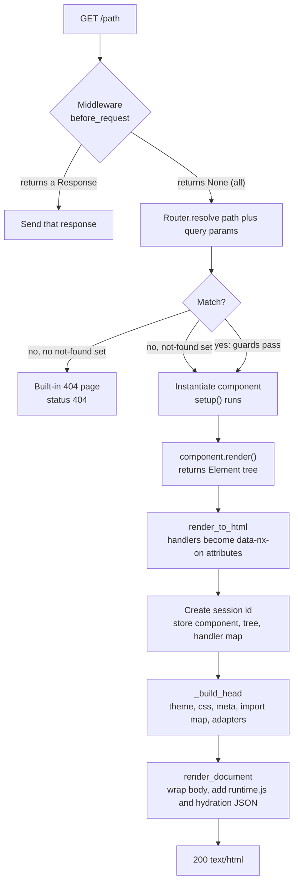

Note: the not-found component, when set, is served with status **200**.

## 2. Hydration

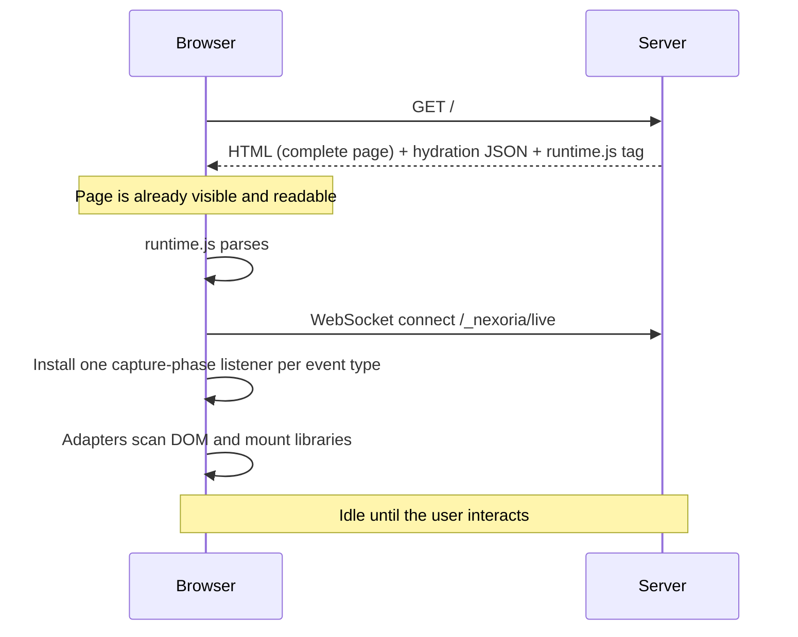

## 3. Event → patch cycle

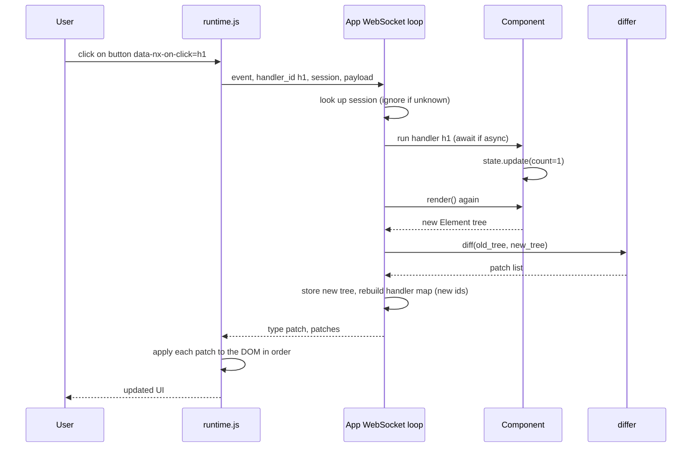

**Worked example** (a real capture from a counter component; the button was clicked once):

```text
→ {"event":"click","handler_id":"h1","session":"dddc02ed…","payload":{"value":null}}
← {"type":"patch","patches":[
     {"op":"text","path":[0,0],"payload":"Clicked 1 times"},
     {"op":"update_props","path":[1],"payload":{"events":{"click":"h2"},"props":{}}}]}
```

The text node inside the first `<p>` changed, and the button's handler id was refreshed (`h1` → `h2`). Paths start at the first element inside `#nx-root`.

## 4. The differ

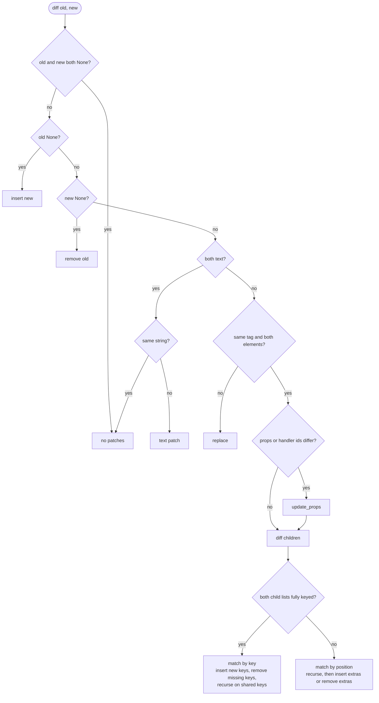

Keyed matching has [documented limits](render.md#known-limitations-of-keyed-lists) (reorders, multiple removals).

## 5. Router matching

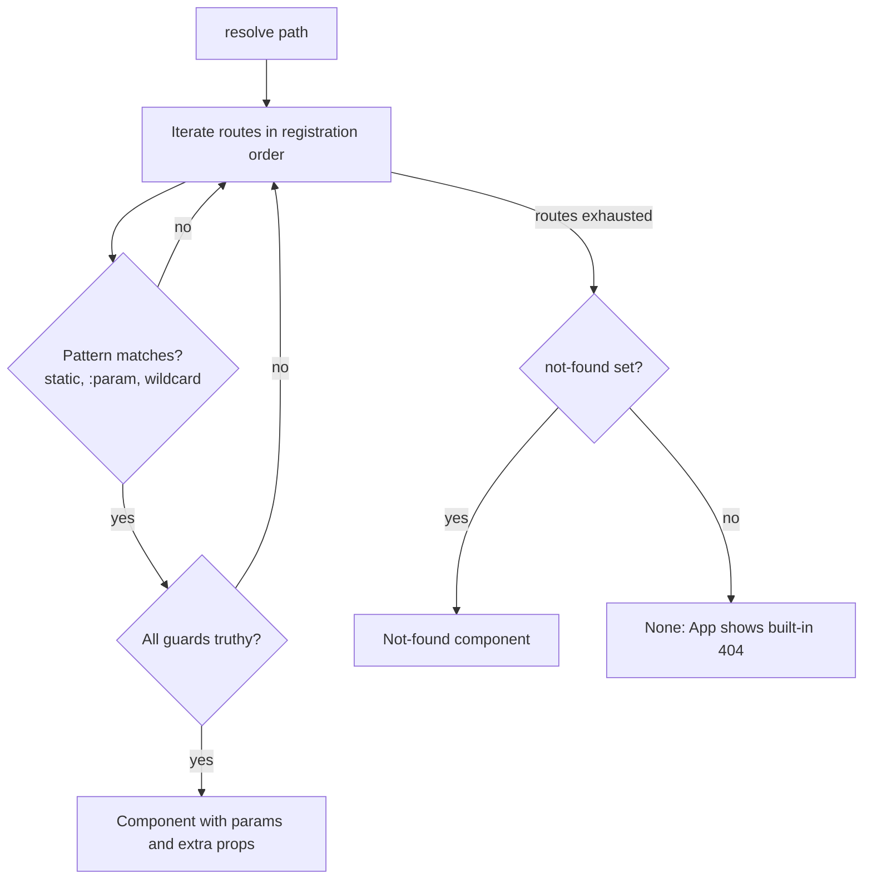

## 6. `App.run()` mode selection

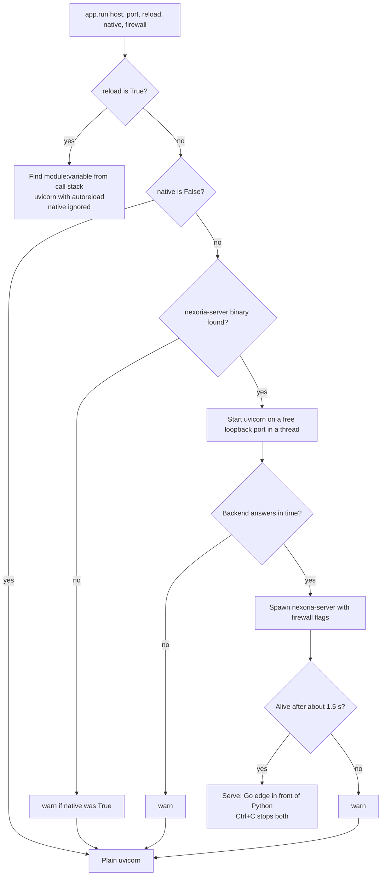

## 7. Go edge request path

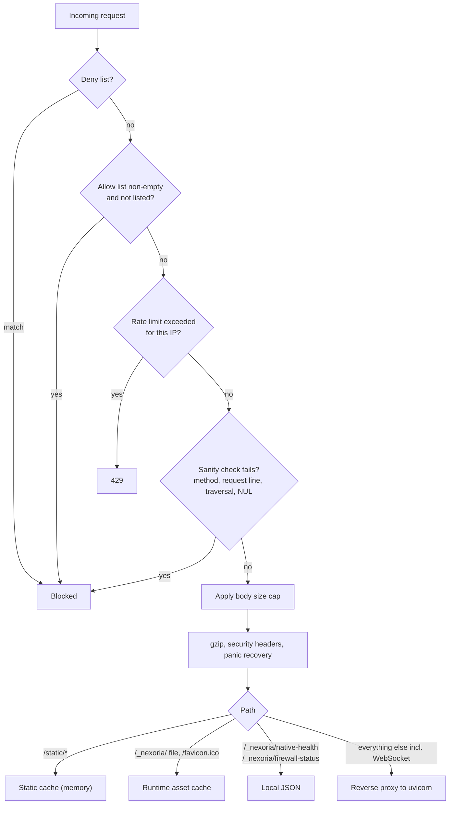

## 8. `<head>` assembly

```mermaid
flowchart LR
    A["base.css link"] --> B["theme :root variables"]
    B --> C["light theme override<br/>if light_theme set"]
    C --> D["app plus component Stylesheet"]
    D --> E["description and Open Graph tags"]
    E --> F["favicon links"]
    F --> G["ONE merged import map<br/>three, gsap, chart.js, aggrid, spline, ..."]
    G --> H["adapter scripts<br/>only for enabled flags"]
    H --> I["classic tags: iconify, QR, OpenLayers,<br/>video.js, Bootstrap, Tailwind"]
```

## 9. Integration lifecycle

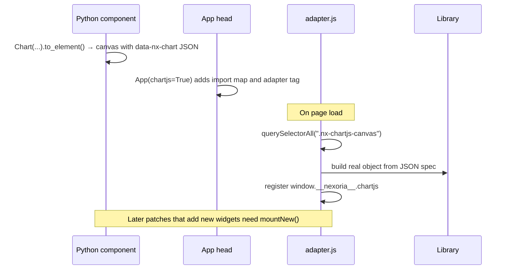

## 10. Native tier selection

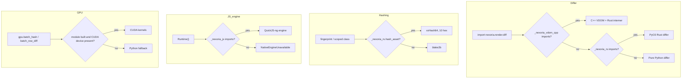

## 11. `nexoria build`

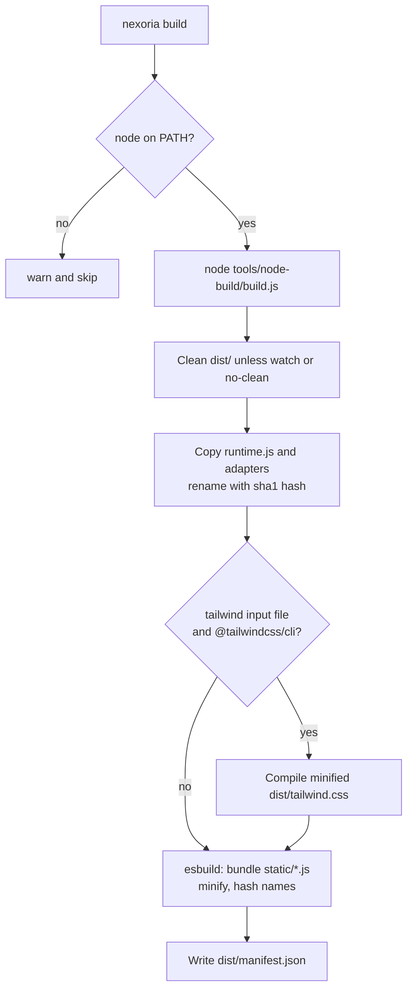

## 12. `nexoria native build`

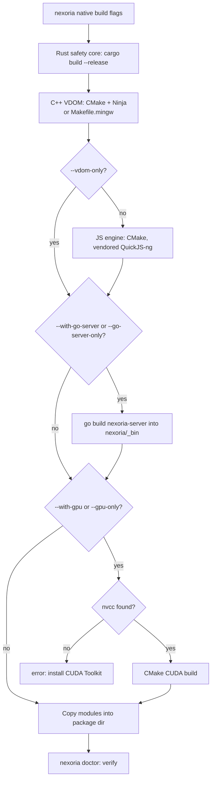

## 13. Theme toggle

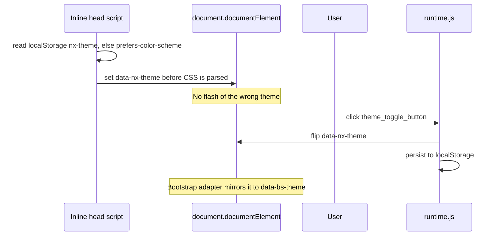
